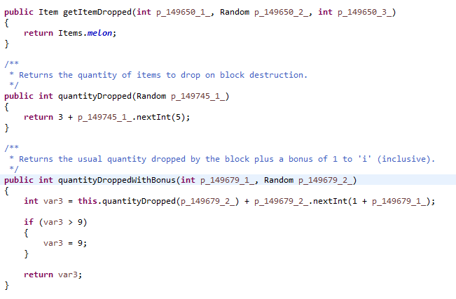
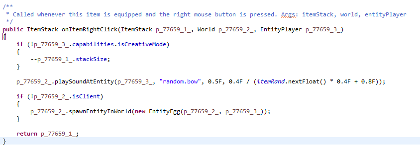
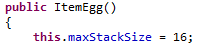
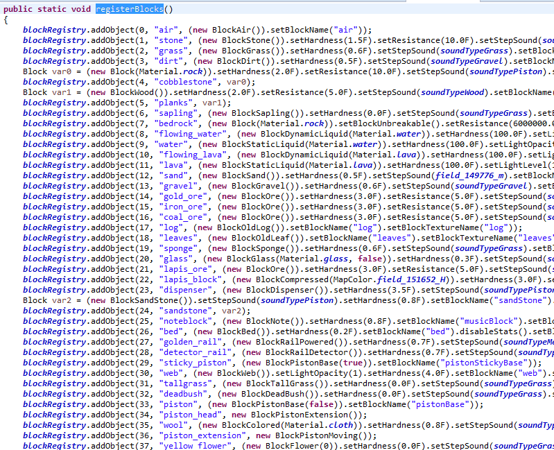
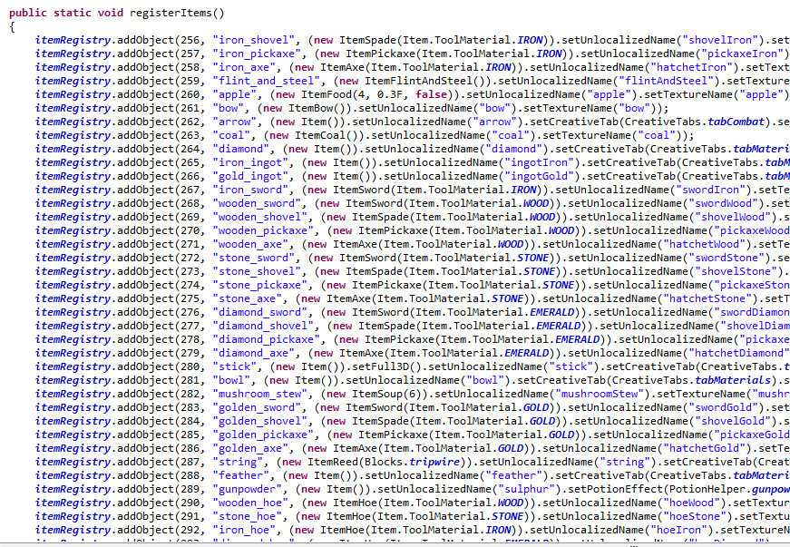

##Block&Item -Family 

方块，我们一进入游戏最先接触到的，也是MC里最基本最原始的东西就是方块，林林总总的方块构成现实世界中各种我们熟知的事物，是的，熟悉而陌生

---
MC中的方块与物品都使用了享元模式[^1]来减轻内存负担，对方块而言，原因很简单，一般我们使用8的视线范围，那么我们将会有大概8388608个方块在内存中，如果每个方块都是一个实例，显而易见，这是对内存资源的巨大浪费[^2]，所以通过享元模式，我们将方块分为数据部分和行为部分，我们通过`world.getBlock(x, y, z)`实际上获取的是这个位置里方块的行为的指代，我们通过`block0==block1`实际上是在比较block0和block1的行为是否相同[^3]，对于物品来讲，Item这个类的实例就是物品的行为，ItemStack[^4]实际上是物品的数据

那么对于方块的数据，MC分配给他5种类型，分别是BlockLID，BlockMID, BlockMetadata, BlockLight和Skylight

类型|用途|占用空间/bit
-|-|-
BlockLID|与BlockMID配合使用，最终和BlockLID一起向外表现[^5]为BlockID|8
BlockMID[^6]|与BlockLID配合使用，BlockID用于在交换数据[^7]的时候区分方块行为|4
BlockMetadata|储存方块行为自定义的额外信息，列如木头用这个来储存朝向[^8]|4
BlockLight|与Skylight配合使用，最终和Skylight向外表现为BlockLightValue|4
Skylight|与BlockLight配合使用，BlockLightValue一般用于渲染和生物生成|4

PS:数据收集自mc1.7.10，各个mc版本可能有差(据我所知这玩意还没变过，当然不考虑远古版本之类的)，可以发现分配的资源很寒酸，最终提交给用户的资源只有4bit(BlockMetadata)是可以自定义的，你只能用来区分16种状态

接下来关于方块的行为，运行时我们一般直接通过`==`来判断，方块的行为全部都继承自net.minecraft.block.Block类，通过覆写Block类中的某些方法，或者添加一些新方法，来体现这个方块的行为，列如BlockMelon(西瓜方块)，我们知道挖掉他会掉几片可怜的西瓜片，这个行为是通过覆写getItemDropped来实现指定掉落的物品，quantityDropped来指定掉落的数量

可以看到还有一个quantityDroppedWithBonus方法被覆写，这个一般是提供时运附魔时挖方块掉落数量的

---
关于物品行为，列如ItemEgg(鸡蛋)，我们知道鸡蛋右击的时候会发射一个鸡蛋飞出去，然后手上的鸡蛋数量会减少，并且我们没法将鸡蛋这个物品堆叠到16个以上(作弊的滚啊)

鸡蛋的行为覆写了Item内的OnItemRightClick方法，并且方法运行时(一般为玩家拿着右击时)，会检测玩家是否是创造模式，不是就减少当前ItemStack内的物品数量(鸡蛋的行为操作了鸡蛋的数据)，然后发出一个声音，然后在服务端生成那个射出去的鸡蛋(这个将在Entity章中细讲)

鸡蛋的行为在这里指定了最大堆叠数不能超过16(然而这只是建议式的，我们可以通过修改ItemStack里的stackSize强制让他变成17)

---
现在，通过享元模式，我们将物品和方块分为数据和行为两个部分，方块和物品看起来界限分明，但他们使用了相同的设计模式，所以你认为这就是我将他们放在同一章讲的原因？再仔细想想，当你挖掉第一块泥土的时候掉到你背包里的是个什么东西？我们知道背包里只允许放物品，那么这个方块是怎么进去的？

他是通过ItemBlock进去的，ItemBlock继承自Item，他内部包装了一个Block，你背包里的泥土实际上不是一个方块，而是一个物品了，他完全具有物品的行为，当你把它拿在手上的时候，它依旧是一个物品，那么当我对着方块右击他是如何放出去的？

ItemBlock覆写了Item内的onItemUse，当物品在使用的时候，被覆写的onItemUse被触发，ItemBlock会尝试将他包装的方块放到世界里(这实际上是不准确的，ItemBlock只包装了方块的行为，因为他内部只存了一个Block类型的引用，所以当你挖掉一个歪这的木头，再放回去他并不会以原来的姿势保持歪的，ItemBlock并不储存方块的数据，如果要在MOD里储存方块的数据，比如TE的电池，你需要搞个新类继承ItemBlock，然后覆写相关的方法)

ItemBlock是方块与物品之间的桥梁，每一个方块默认都有一个ItemBlock的实例，可以通过`Item.getItemFromBlock`这个静态方法获取

那么物品到方块直接有没有桥梁呢，很抱歉，MC原版是没有的，你可能需要装一些MOD才能将你手上的物品，比如一把钻石剑，插到地上

---
上面我提到了BlockID，这个是在交换数据的时候用于区别方块行为的，相应的，物品也有ItemID，用来在交换数据的时候区别行为(实际上，运行时区别行为靠行为实例的对象头内的内存地址，然鹅在交换数据的时候这个地址当然是没法用的)

有了ID，我们得有个统一的颁发ID的机构才能方便我们的使用，MC是这么解决的

当然省略了很多，虽然是1.7.10的数据，方块和物品也是相当的多，我们同时可以发现，ItemID从256开始注册，BlockID从0开始注册，ItemID空了256个实际上是给ItemBlock用的，在registerItems函数的最尾部，有一个循环遍历所有在blockRegistry中注册过的方块，并移入itemRegistry中，所以registerBlocks必须在registerItems前运行，不然会造成系统级的错误

---
如果经常在MODDING中接触方块和物品，再发挥些想象，方块和物品实在是太像了，首先他们都是享元模式，明确的分为数据和行为两个部分，是的，行为，为什么物品的行为不能算是方块的行为？ItemBlock的存在是否同样预示着BlockItem？

某种意义上，方块和物品是一家人，这才是我将他们放在一起讲的原因，如果将物品和方块统一起来，我们统称方块，这完全可行(实际上是因为BlockItem的可存在性)，而且不管是ItemBlock还是BlockItem，不再需要这些桥来集中交流了，我们可以把各种各样的物品放在地上，嘿，掉落物？想到了什么？砂砾！FallenBlock某种意义上可以理解为掉落物！

将物品系统和方块系统统一起来，MC是否变得更加和谐？不，这里有一些障碍等待我们清除，个人认为MOJANG已经考虑过统一，只不过卡在了这步上

原因在这里，要知道方块的储存空间是十分寒酸的，一共分了24bit一个方块储存，而物品储存，ItemStack需要32bit来储存物品数量，虽然mc基本上是64打顶，一共用掉6bit，然而最要命的是ItemStack有一个stackTagCompound，这是一个NBT类型的数据，他完全能轻松超过24bit，扩容方块储存？已经很要命了，万级的方块，扩容1bit加起来都可怕，ItemStack本身数量少，不需要过于考虑这些问题，显然，方块储存没法满足物品储存，这里出问题了，要让他们统一，最大的障碍就是方块没法储存NBT数据，Map<BlockPos, NBT>？鬼才会这么做，一放多就简直了，所以，无奈于没有解决方案，统一被放弃了，采用了分家的方式

PS:MOJANG后来提出了调色板机制[^10]，按道理应该解决这个问题，然而MOJANG的调色板同样是十分寒酸，他要求列出所有可能的储存状态(比如一个byte，要列出0~255)然后，然后如果你想注册两个byte，完美，MC会卡爆掉，因为MOJANG的调色板属于全局调色板，他将你0~255个状态下的某方块全部注册成新方块，256*256个方块，撑不住的。可实际上，局部调色板的实现并不难，见TPalette[^11]，现在方块数据里储存NBT数据已经可行了，而且还优化了MC原版的储存，当然，这个实现也有他的短板，如果一个区块段(可以简单理解为一个16x16x16的空间，我在World章会讲)过于'缤纷'，那么这个实现的性能将会大幅降低，这里的缤纷，意思是16x16x16里具有不同数据的方块数量过多，最极端的情况就是整个区块段里每一个区域的方块都不一样，不过这种情况很少见

[^1]:见[维基百科](https://zh.wikipedia.org/wiki/%E4%BA%AB%E5%85%83%E6%A8%A1%E5%BC%8F)
[^2]:都浪费在对象头和padding上，享元模式一个方块只有一个对象头(这个对象头来自这个方块的行为，一个Block类的实例)
[^3]:一般可以这样认为，特殊情况比如矿辞，不同的MOD都可能搞了这么一个铜矿的方块，然而这是不能用`==`来判断的，他们实际上是两个实例
[^4]:ItemStack里值得关注的有item(一个Item类型，指向他所属的行为)，stackSize(物品数量)，stackTagCompound(物品自定义的标签，比如附魔的数据就存在这里)，itemDamage(有用来区分同一个物品的不同状态，比如染料，唱片就用这个，还有物品受损，比如一把剑，用的下面那个绿色的条)
[^5]:算法是`LID|MID<<8`
[^6]:BlockMID是自Anvil地图储存更新后新加入的，用于解决BlockID空间紧张问题
[^7]:比如保存地图数据，或者读取地图数据，再如从服务端下载，上传数据等
[^8]:木头不是有4个面都是树皮，2个相对的面是年轮的那个吗，在放置方块的时候不是会有不同的朝向？
[^9]:客户端的一个渲染模式，比方说Fancy模式下树叶是透明的
[^10]:一种内存模型，见[维基百科](https://en.wikipedia.org/wiki/Palette_(computing))
[^11]:见[Github](https://github.com/TPCoRE/TPalette)
