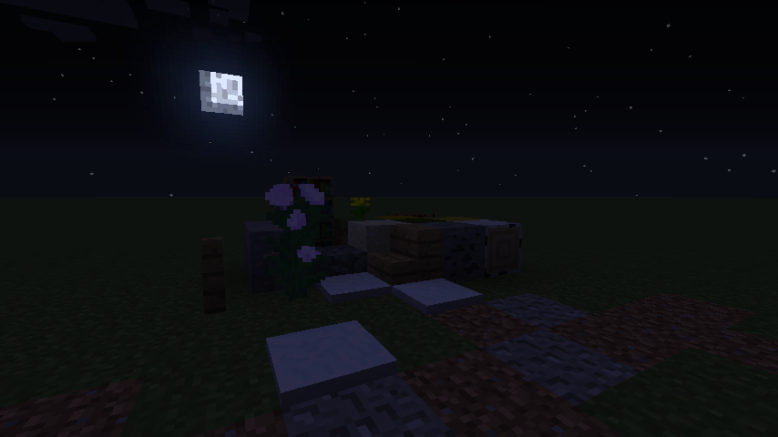
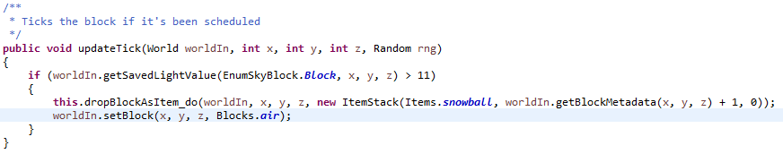
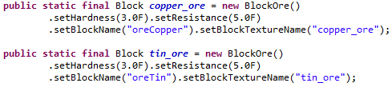

# Chapter I



## That is how we choose to imagine many things

如果有人问你方块是什么，你可能会指着Block类回答，"这就是方块！"，就像我们会指着Item类说这就是物品一样，一些经典的用法例如，通过```world.getBlock(x, y, z) == Blocks.stone```，我们说xyz那有块石头，然后执行```world.setBlock(x, y, z, Blocks.air)```，我们说石头挖掉了，通过```==```来判断是否是相同的方块，就像我们以```itemstack0.getItem() == Items.apple```来断定一个物品是否是苹果，如果有天我们想在这粒苹果里留下点数据，我们会调用```itemstack0.stackTagCompound```获得这个物品的NBT数据以操作；如果想给某块石头留下点印记，一个快速的方法是使用BlockMetadata，只有4bit的空间可用，通过```world.setBlockMetadataWithNotify```和```world.getBlockMetadata```输入方块坐标来修改和读取，诺如我们对这块石头有太多事情想做的话，通常会使用TileEntity来解决，新手们总会犯一种错误，他们在新建的Block子类里加入例如```public int abc```的成员，然后通过```world.getBlock(x, y, z).abc = 123```来修改所谓的数据，接着他们会在另一个位置的```abc```里发现它也等于123


> 这个函数讲述了一个雪方块如何在过11的强光下变成几个雪球的过程，方块的BlockMetadata用来表示雪的厚度

这些现象，众所周知的，通过这些方法，或许直观的感受是方块储存的不便，但对新手犯错的反思，犯错的原因，之所以想在某方块里储存数据会通过```world.getBlock(x, y, z).abc = 123```来实现，显然新手把不同区域```getBlock```出来的东西认为是不同实例，而我们通过```==```来判断已经说明了他获得的必须是同一个实例，不然我们应该用```world.getBlock(x, y, z).equals(Blocks.stone)```。不过，这样真的是错的吗？如果是这样，Block类里的```blockHardness```和```unlocalizedNameBlock```，Item类里的```maxStackSize```和```itemIcon```又是什么，为什么他们不是错误？

考虑这些成员，他们是什么，```unlocalizedNameBlock```是方块的名字，例如对草方块，```world.getBlock(x, y, z).unlocalizedNameBlock == "grass"```永远成立，所以所有的草方块都叫草方块；对于雪球，```itemstack0.getItem().maxStackSize == 16```恒成立，所以所有的雪球都只能堆叠到16；对于新手的方块，```world.getBlock(x, y, z).abc == 123```恒成立，所以所有的新手方块里的```abc```的值都是123，那么既然如此，```abc```错又错在哪里？

新手的目的，是改变这个方块的```abc```的值，但他通过改变所有方块```abc```的值来实现，这就错了，因为他的目的仅仅是改变这个的```abc```的值而不是全部的；他只想改变这个个体的，而不是群体里每个个体的，而他通过改变所有的来改变自己的，这就是错误所在。```abc```没错，就像```unlocalizedNameBlock```，```maxStackSize```之类的一样，他们属于群体里的每一个个体，每个个体在这方面上都是一样的，他们是群体公共部分中的一份子，而新手的```abc```，实际上是给这个公共部分添加了一份子，是给多给了每个个体一个公有的属性，新手的错，不过是错把他当成个体单独拥有的罢了

那么，我们总说的Block是方块，Item是物品，这应该在群体和个体上有所区分，Block实例和Item实例指的是群体的公共部分，既一个实例是一种方块或是物品，而方块和物品指的是个体


> 如图展示了一种叫做铜矿，和另一种叫做锡矿的方块

既然如此，我们知道了所谓的Block，Item实例是公有部分，那个体又是什么，一个个体，应该还包含除了公有部分以外的东西，什么东西不会随着公有部分的改变而改变？一个个体所独有的，显然，BlockMetadata就是他的体现

实际上，不止有BlockMetadata，MC还有另外两个——BlockLight和Skylight

类型|用途|占用空间/bit
-|-|-
BlockMetadata|这个就是刚才说的了，用来储存方块个体特有的部分，列如木头用这个来储存年轮面的朝向|4
BlockLight|与Skylight配合使用，最终和Skylight向外表现为BlockLightValue|4
Skylight|与BlockLight配合使用，BlockLightValue一般用于渲染和生物生成|4
> 数据采自MC1.6.4，到1.13还没变过，可以说很稳定

可以看到给予方块的储存空间很寒酸，这也是为什么我们要把公有部分提取出来的原因，想象一下，我们将```unlocalizedNameBlock```从公共空间里剔除，转入个体空间，结果是要多申请多少bit，这对于用万级做单位来形容数量的方块来说，多一个bit都是不切实际的

> 你应该已经看出来了，这是明显的享元模式，我们将数据中大量重复的部分提取出来单做一块，这就是我说的公共部分，保留每个个体所独有的部分，就是我说的个体部分


那么一个物品个体是什么，既然Item实例是公共部分，那么他的独有部分在哪，是否跟方块一样，体现在BlockMetadata上，物品体现在```stackTagCompound```上？在ItemStack的每个成员里？这样的话，我们可以认为一个ItemStack实例就是一个物品了，因为一个ItemStack包含一个```item```代表他的公有部分，而```stackSize```，```stackTagCompound```等作为他的独有部分也存在于ItemStack中

看起来没问题，现在考虑你的背包里有一组石头，你认为他有多少个物品，64个石头，64个物品，然而他有多少个ItemStack实例？一个而已

这显然反驳了一个ItemStack就是一个物品的推论，的确是一个ItemStack一组石头，只不过这个实例的```stackSize```的值是64，我们所谓的物品只不过是64这个数字里的一个1而已，这64个物品的种类是一样的，就是这个实例里```item```所指的，他们的数据也是一样的——他们都具有相同的```stackTagCompound```，既然他们的公有部分一样，而个体部分也一样，那么就等于说共有部分包还含个体部分，这是否是一种享元模式，极端的享元模式，所有个体都一样，以至于我们表示这个群体只需要共有部分和个体的数量就足了，而这个群体的公有部分，```item```，```stackTagCompound```和```stackSize```在哪，ItemStack里，这不就等于说ItemStack是这个群体的表现吗

本就是这样，ItemStack被译作物品栈，Stack的存在，他便不再代表一个物品，而是一堆物品了

> 实际上你会发现MC的代码里根本不存在所谓的物品，一切物品都是扎堆存在的，既ItemStack实例，物品个体的体现，不过是```stackSize```里的一个1罢了

这样的话，目前为止的情况是

类型|情况(群体)|情况(个体)|储存方式
-|-|-
方块|一个Block实例代表一种方块|一个Block实例加上他的个体部分，例如BlockMetadata|享元模式，共享的部分既Block实例
物品|一个Item实例代表一种物品，而一个ItemStack实例代表一个物品群体，满足极端享元|一个物品个体体系在ItemStack实例中，```stackSize```里的一个1|享元模式，共享的部分是Item和ItemStack实例

