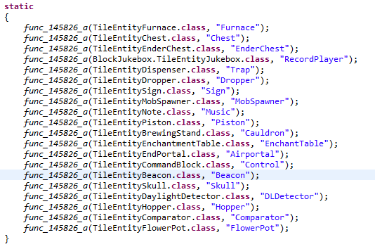
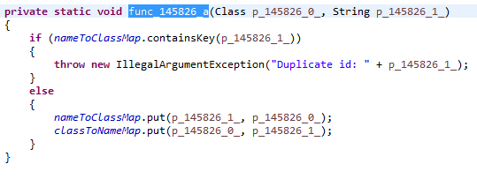
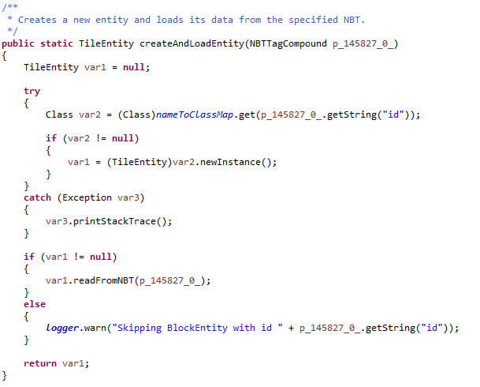

##TileEntity -Concomitant Entity  

在上一章的讲解中我提到了方块储存寒酸的问题，并且提到了Block类的实例是方块的行为，现在，我要在这一章中对方块做一些补充，你想必已经使用过一定数量的模组，一些主流模组比如IC2，TE，各种各样的机器都是方块，那么问题来了，比如IC2的打粉机，不是说没办法储存物品吗，打粉机里的物品，比如一些铜锭又是怎么回事？而且不考虑MOD，单单MC原版的熔炉，我就可以在里面放物品

---

是的，里面的物品确确实实，当然24bits也是确确实实放不下物品数据，那么我要如何实现一个熔炉？要实现一个熔炉，熔炉里必须能存物品，不然我要如何烧他，要储存一个物品，必须得先能在方块数据里储存NBT数据，这完全办不到，那么我们只能放弃在方块数据里存，那就只能`Map<BlockPos, NBT>`这样了，进而就演变出了TileEntity，一开始的Map就变成`Map<BlockPos, TileEntity>`，进而为了防止错乱，我们给方块行为多添加了一种行为，要使用它，你的Block必须`implements ITileEntityProvider`，这个interface里定义了一个createNewTileEntity函数，用来在你的方块放置的时候，伴生一个TileEntity

如下是TileEntity类里一些值得关注的结构

成员名称|类型&修饰符|用途简介
-|-|-
nameToClassMap|`private static Map<String, Class<? extends TileEntity>>`|读数据的时候使用
classToNameMap|`private static Map<Class<? extends TileEntity>, String>`|写数据的时候使用
blockType|`public Block`|储存此TileEntity对应的方块行为
tileEntityInvalid|`protected boolean`|标记TileEntity的生死状态，用于删除TileEntity
readFromNBT|`public void(NBTTagCompound)`|从NBT中读取数据
writeToNBT|`public void(NBTTagCompound)`|向NBT中写数据
updateEntity|`public void()`|这个函数每一帧都会被调用一次
createAndLoadEntity|`public static TileEntity(NBTTagCompound)`|用来将NBT数据反序列化为一个TileEntity

由此，我们可以在方块行为里通过TileEntity来储存额外的数据，实现ITileEntityProvider后，`world.getTileEntity(x, y, z)`出来的就是你createNewTileEntity里返回的实例了

至于createNewTileEntity(createNewTileEntity)这个方法，一般在MC载入地图数据的时候会被调用，这时候MC不会调用你的createNewTileEntity方法，同时，你的TileEntity必须在nameToClassMap和classToNameMap有注册，不然会在序列化的时候出错

所以，你必须得在某个地方注册你的TileEntity，然后才能使用它，而且你的TileEntity必须提供一个无参的构造函数，不然当你退出世界再重新进入的时候，你会发现你的TileEntity没掉了，这时候你不得不把你的ITileEntityProvider挖掉再放一遍，然而之前的数据还是丢失了

PS:你可能会吐槽为什么不用Class.forName，值得注意的是MC可是带混淆的，用类名字就是abc这种，而且每次版本更新名字都会变，abc下次变成ujk也说不定，直接用类名的话，高版本端没法兼容低版本地图

注意到updateEntity方法，他会在每一个MC帧[^1]被调用一次，而总览Block类提供的函数，相似的只有updateTick方法，而updateTick这个方法只使用于缓慢更新，可能好几帧以后，甚至是好几秒以后，updateTick才会被调用到一次，调用时机无法保证(所以经常叫他randomTicks)，而updateEntity是每帧一次的快速更新，因此你的方块行为可以搞得超级快，像IC2的感应炉那样飞快的烧矿，实际上，你会发现Block类里提供的方法全是被动调用[^2]，TileEntity将你的方块提升为主动调用，像一个实体一样能主动的跟上时间的脚步，所以这一章的小标题叫伴生实体

当然，TileEntity有他的短处，他基于Map<BlockPos, TileEntity>，而且每一帧都会消耗CPU资源，他类似一种轻型实体，放多了会造成性能问题，但是没多少人会这样，有人会把一整个区块放满熔炉吗？

但是，只要你的TileEntity在updateEntity里不做太多可怕的事情，一般的机子还是撑得住的，我在放满大概第11个区块的熔炉以后，超平坦下30多的FPS降到了4FPS左右，当然，没人会吧11个区块都放满熔炉

[^1]:MC内部用来描述时间的单位，和秒的换算是20ticks/1s
[^2]:这实际上是不准确的描述，但是相对于其他方法而言，Block类里的方法的确很被动，比如被挖啊，被放啊，被实体经过之类的，这样做是为了节省CPU资源，如果每个Block都带一个TileEntity的updateEntity，想一下，万级的方块，撑不起
