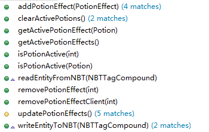
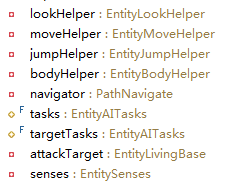
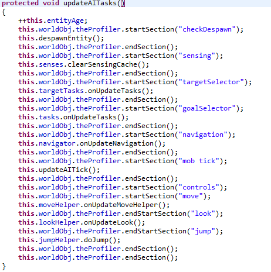
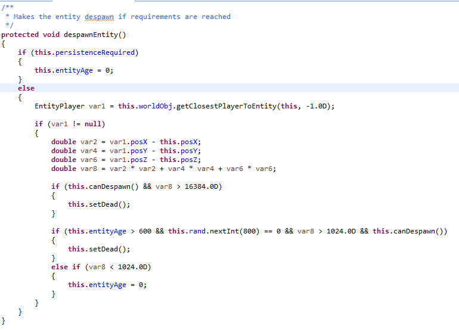
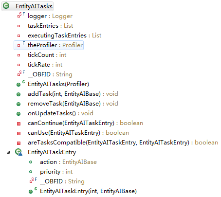
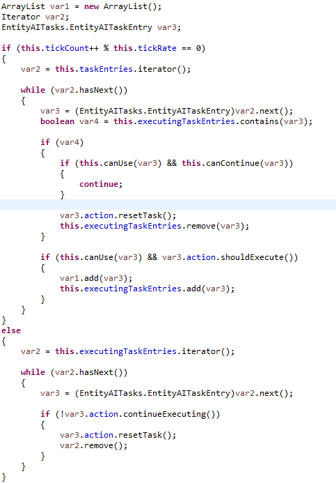
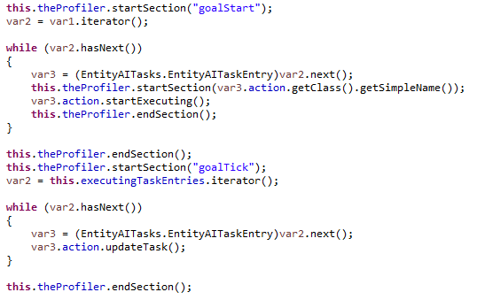
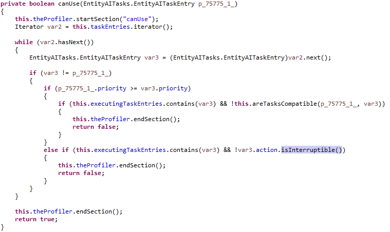
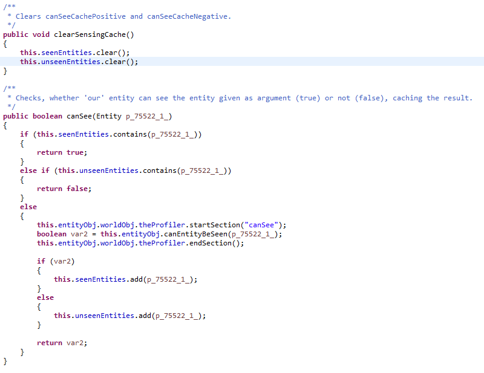

##Entity -Spring Fairy 

你可能觉得这章的小标题过火了点，但的确，MC的实体可能没那么可爱，但应该是必不可少的

---

实体可以理解为TileEntity的进阶版，同样的，Entity和TileEntity都不是享元模式(这当然)，一般来讲，物品，方块，TileEntity和实体遵循下面的数量等级出现(仅做参考)

类型|数量级|一般原因
-|-|-
方块|万|众所周知，填满一个区块需要16x16x256个方块，8的渲染距离就有16x16个区块保持活动，加起来有百万了应该，哪怕去掉某些原因未载入(会在World章讲解)
物品|百|你一个背包放满物品，就有36个ItemStack实例，按照我给物品的定义，行为和独立的数据(注意这包括stackSize)算一个物品，那么你有36个物品保持活动，当然一般考虑他是百级的，这包括服务端中多人下好几个背包，打开箱子，怪潮之类的情况等
TileEntity|百|正常应该是几十个打顶的，考虑到红石密集型，或者某些大型的生产作业，一些科技或者魔法服务端峰值的情况有可能到千级
实体|十|正常50左右就算比较多了，当然这只是客户端来说，服务端应该在百级左右

这些数据基本是不可靠的，但能保证的是方块的数量一定是最多的，实体应该是最少的，所以，根据情况物品和方块用享元模式，实体，TileEntity相对较少，就直接行为类里带数据的普通模式了

PS:实际上，物品使用享元模式很可能是因为我在第一章所讲的历史遗留问题(那个MOJANG试图统一方块和物品)，说实在，MC内部以及我的定义都将一个物品定为行为和独立的数据，方块也是这样，不过如果你读过ItemStack类的源码，你会发现他实际不简单是堆数据，他内部很多桥方法引到Item类里，完全可以把Item类和ItemStack类合为一体，那么现在的情况，我们可以把一个ItemStack视为一个物品，把一个Block类的实例和某个位置的方块数据视为一个方块

现在言归正传，实体提供了一些TileEntity所没有的东西，并且不再是方块的伴生物，他完全独立的存在于世界中，所以摆脱束缚的TileEntity去掉了Tile，变成了Entity

可能有人需要Entity的继承关系图，因为继承关系过于繁多，这里显示出来会特别的长，得到这张图很简单，只需要在Eclipse中对着Entity类右击，看到Open Type Hierarchy选项点一下就可以了，我们这里只讲一些比较特殊的Entity和Entity这个抽象类本身，别希望我能把每一种实体都揪出来溜一遍，他的儿子实在是太多了

如下是Entity类里一些值得关注的东西

成员名称|类型&修饰符|用途简介
-|-|-
pos(XYZ)|`public double`|标记当前实体位置
motion(XYZ)|`public double`|当前实体的速度(注意这是不准确的)，并且这是客户端才有的东西
rotation(YawPitch)|`public float`|标记当前实体旋转的欧拉角，注意是没有Roll的
boundingBox|`public final AxisAlignedBB`|一个AABB碰撞箱，一般用于碰撞检测相关的事情，他基本上等价了这个实体的体积和他的形状(也有不准确的情况[^1])
isDead|`public boolean`|标记实体的生死，与TileEntity的tileEntityInvalid类似，World类将在每帧中管理这实体和TileEntity，判断为死后会将其删除，我将在World章讲到
fallDistance|`public float`|标记了实体的下落距离，他将决定这个实体碰到地面以后会有多惨，值得好奇的是MC里关于摔惨的计算不是靠速度而是掉落距离的
noClip|`public boolean`|当他为true的时候碰撞检测对他失效
ticksExisted|`public int`|自从这个实体加入到世界以来，他经历了多少帧
worldObj|`public World`|标记当前实体所处的世界，和TileEntity的worldObj类似
entityID|`private int`|在网络中交换数据的时候区分实体，他有对应的getter和setter方法
dataWatcher|`protected DataWatcher`|在网络中交换数据的时候，这里面存的数据将被同步，他有个getter方法
equals|`public boolean(Object)`|覆写了Java里Object类的方法，他通过entityID来判断两个实体是否相等
hashCode|`public int()`|覆写了Java里Object类的方法，直接返回entityID作为hash码
onUpdate|`public void()`|同TileEntity中的updateEntity，Entity类里还有onEntityUpdate方法，这样的作用应该是将各种更新分开，Entity类里的onUpdate直接调用了onEntityUpdate，这个方法里写了Entity的基础更新，例如跨世界传送，岩浆里着火，Y坐标过-64直接挂掉之类的
moveEntity|`public void(double, double, double)`|这里移动实体，调用他将立即产生效果，同样的有一个叫addVelocity的方法，调用他会改变motion(XYZ)的值，这就是为什么motion(XYZ)不代表一个实体的速度的原因，他实际上是不准确的，我将在后面详细的介绍，可能是本书里唯一一个需要一行一行分析代码的地方，等你读到Misc章就有了
getBrightness|`public float(float)`|获得这个实体的亮度，用于在客户端渲染，值得注意的是一个很大的实体，只返回一个float作为描述实际上是不够的，不过没有那么大的实体(他可是只从worldObj里getLight一次而已，而且是计通过碰撞箱，计算出一个合适的坐标去get)，类似的方法有getBrightnessForRender，要注意两个是不一样的，forRender有考虑到Skylight，也就是会计算到天空的亮度
applyEntityCollision|`public void(Entity)`|这个地方就是产生牛肉大炮(一堆牛塞到一小块区域里)的地方
attackEntityFrom|`public boolean(DamageSource, float)`|实体在这里接受攻击，如果你重写他并不给他任何功能你实体就不会扣血，不过血量是EntityLivingBase里的事，这章篇幅会很长，我有很多要讲，注意他返回的是一个布尔值，代表是否攻击有效(比方是来自岩浆的伤害，我返回false间接代表我免疫，攻击失败了)
hitByEntity|`public boolean(Entity)`|返回true就表示传入实体无法攻击本实体，一般用这个能阻止attackEntityFrom的触发，只要返回的是false，那么attackEntityFrom会被触发，Entity类里默认返回false
writeToNBT|`public void(NBTTagCompound)`|同TileEntity的writeToNBT，这里记录一些实体的基础信息
readFromNBT|`public void(NBTTagCompound)`|同TileEntity的readFromNBT，读取基础信息
readEntityFromNBT|`protected abstract void(NBTTagCompound)`|调用自readEntityFrom，是Entity提供给子类的NBT接口，我们一般都覆写这个方法
writeEntityToNBT|`protected abstract void(NBTTagCompound)`|调用自writeToNBT，同样的，Entity提供给子类的接口，一般覆写此方法
rand|`protected Random`|随机相关
interactFirst|`public boolean(EntityPlayer)`|玩家与实体互交时(例如右击这个实体)，会触发此接口，返回值代表是否有效(true的时候玩家的手会动的)
onCollideWithPlayer|`public void(EntityPlayer)`|当玩家碰到本实体后被触发，注意和applyEntityCollision不冲突，如果是玩家撞到本实体，那么这两个，一般是applyEntityCollision先被调用，然后是onCollideWithPlayer被调用，这个默认是一个空函数

可以看到，光一个Entity类就有很多成员了(实际上我隐藏了很多，这里挑些我感觉值得关注的讲，同时推荐一下，Eclipse的Open Call/Type Hierarchy真的挺不错)

可以对比一下和TileEntity的差别，他的确解放了TileEntity，从描述空间关系上的解放(精度提高，int到double，可以搞平滑移动，如果是方块的移动，他的移动单位可是1m)，并且提供了motion和moveEntity，addVelocity之类的成员，这样我们可以轻松的移动一个实体，并且这些都会自动进行碰撞检测

TileEntity有点像某些方块的幕后工作者，他不会面向用户，而实际上打开GUI，一些特殊方块的渲染都是靠TileEntity的，所以旋转对TileEntity来说似乎是一个累赘，对实体就不一样了，因此实体里出现了欧拉角用于描述旋转，另外，这玩意是角度制而不是弧度制，需要强调这个旋转跟碰撞检测没有任何关系，不是说AABB在实体里就被描述成OBB了

实体这个系统在MC的代码里体现得很重型，我们的春之精灵可是非常胖的，而且超能生...我们可能得给他换个外号，比如蜂王之类的

接下来我讲Entity类中云云众子里比较具有代表性的几个分叉，他们分别是EntityLivingBase，EntityLiving，EntityPlayer，EntityFallingBlock，EntityItem和EntityThrowable

###EntityLivingBase -Origin of Life 

EntityLivingBase直接继承自Entity类，他最具代表性的就是给Entity类修饰了血量和BUFF这两个概念，所以我们叫他生命之源，下面是他的部分成员表

成员名称|类型&修饰符|用途简介
-|-|-
attributeMap|`private BaseAttributeMap`|这里面通常存着一个实体的属性，例如最大生命，移动速度之类的
applyEntityAttributes|`protected void()`|一般在这里初始化实体的属性
activePotionsMap|`private final HashMap`|这里就是储存buff的地方，buff会在每一帧中影响这个实体
_combatTracker|`private final CombatTracker`|这是MC给攻击与被攻击这个关系加的成员，可以用来追踪实体的攻击与被攻击记录，聊天栏显现出你是如何被搞死的信息就是从这里来的，他会在一段时间后清空数据，时间要么是300帧要么是100帧
getEquipmentInSlot|`public abstract ItemStack(int)`|输入0获得手持物品，1获得鞋子，2获得腿，3获得胸甲，4获得头盔，他有一个同样抽象的setCurrentItemOrArmor方法作为setter
attackEntityFrom|`public boolean(DamageSource, float)`|对Entity类的覆写，这里他给非玩家使用了hurtResistantTime和maxHurtResistantTime来进行短时间内大量攻击的免疫，10帧(默认的，具体是maxHurtResistantTime的二分之一)之内连续打实体，当前伤害如果比之前打的低，那么免疫这次伤害，就是说如果你的伤害第一次最高，然后慢慢减弱，那么目标实体只受最高那次的伤害，如果相反，那目标实体所有伤害都收到了，EntityLivingBase内有个lastDamage做记录，并在适当的时候将hurtResistantTime更新为maxHurtResistantTime的值
damageArmor|`protected void(float)`|损害当前护甲，默认为空函数，传入的是护甲接受到的伤害
damageEntity|`protected void(DamageSource, float)`|调用自attackEntityFrom，面向子类，用于处理伤害，默认这里会扣血，并将记录放入_combatTracker(里面还有一套动态的伤害吸收机制，基于护甲和BUFF，包括伤害吸收BUFF，同时动态调整伤害的时候会调用如damageArmor的函数)
onDeath|`public void(DamageSource)`|调用自attackEntityFrom，当本次攻击使实体的血量小于等于零时调用此方法，EntityLivingBase在此写了掉落实体身上的东西
onKillEntity|`public void(EntityLivingBase)`|这个实际上是定义在Entity类里的(一个空函数)，EntityLivingBase并没有覆写他，定义在Entity类里实际上没有问题，但因为涉及了EntityLivingBase，所以我把它放在这里，同样这玩意的调用只出现在EntityLivingBase的onDeath里，在自己死掉的时候调用给自己最后一击的攻击者的onKillEntity函数，僵尸(EntityZombie)通过覆写这个方法实现了感染村民(打死村民后原地生成僵尸村民...)
onDeathUpdate|`protected void()`|死亡的时候每帧被call直到超时，默认20次调用后，下面我会详细讲
getRNG|`public Random()`|在Entity类里就有rand的变量，然鹅并没有他的getter，现在这里有了
getArrowCountInEntity|`public final int()`|有多少跟箭插在你身上，他有个setter方法
onItemPickup|`public void(Entity, int)`|当你摸到一个掉落物，或者一个经验球，或者你射出去的箭时，我们通过这个函数把它捡起来
rayTrace|`public MovingObjectPosition(double, float)`|一个挺不错的工具方法，他会以当前实现(getLookVec方法)调用World类里的rayTrace来返回第一个碰撞到的实体或者方块
onLivingUpdate|`public void()`|也是一个更新函数，调用自onUpdate，在onEntityUpdate之后运行
onEntityUpdate|`public void()`|覆写了Entity的，会先调用父类函数，再进行窒息检测，一个是检测是否在墙里，一个是检测在水里，在水里还会额外的取消骑乘状态，并且非玩家实体在这里会自减hurtResistantTime的值
getAir&setAir|`public int() or public void(int)`|首先这个在Entity里就定义了，通过dataWatcher，但是在ELB里才用到
collideWithNearbyEntities|`protected void()`|每一帧都会被onLivingUpdate调用更新，抓到碰撞的实体以后会调用本实例的collideWithEntity(Entity)并传入碰到的实体，collideWIthEntity的实现默认是调用传入实体的applyEntityCollision(Entity)方法并将自己传入(EntityLivingBase没有重写applyEntityCollision)

我只能说EntityLivingBase虽说是个中间类，然而他还有很多我没列举出来的成员[^2]，现在我们从EntityLivingBase最关注的生命开始讲

#####Life

你会发现我列举的成员表了没有health之类的东西，的确EntityLivingBase，以下我简称为ELB，并没有这个成员，他只有一个prevHealth在实体受到攻击的时候记录攻击前的生命值，用于在你游戏HUD的生命栏里闪一下，表示你扣了多少血，生命这个数据实际上是存在Entity类里的dataWatcher里，他可以在网络中同步数据(感觉dataWatcher很便捷？想在你的MOD里使用？我劝你别，这我将在Network章里讲)

现在我们讲讲ELB的生死概念，众所周知，ELB里有一个health概念(他是一个float型变量，你可以通过getHealth和setHealth来操作他)，那么，是否是当health小于等于零，这个实体就算是凉了呢？如是的话，onDeathUpdate又是如何实现的。实际上，系统对于一个实体是否死掉的判断仅仅是依靠Entity类里的isDead，ELB的health是面向他本身和他所有的子类的，并不是Entity的概念，Entity里只有生或者死两种状态，不要混淆了

ELB的生死态实际上有三种情况，生，死，假死[^3]，对于生死的判断很简单，isDead直接联系着，但是假死的状态，isDead为false，但是health小于等于零的状态就是假死状态，ELB在覆写Entity类的onEntityUpdate里，判断到health小于等于零，就执行onDeathUpdate函数，onDeathUpdate才是真正控制实体生死的地方，默认情况下(子类没有覆写)，onDeathUpdate被调用20次以后，当即调用Entity类里的setDead函数让实体挂掉，并留下遗产(ELB这里是产生经验值，实体带的东西在onDeath里掉完了)，所以你可以通过覆写onDeathUpdate来实现实体的复活，或者是一些后事的处理

#####AttributeMap

可能有人会好奇attributeMap，他在MC的代码里有点复杂，有baseValue和modifier，他用样是从ELB才有的概念，面向自身和子类，这里我细讲一下

AttributeMap的概念主要涉及BaseAttributeMap，IAttributeInstance，IAttribute和AttributeModifier，BaseAttributeMap是个抽象类，他的功能是储存IAttribute和IAttributeInstance之间一一对应的键值对

IAttribute是个接口类，他代表这个实体属性的属性，例如名字，初始值，并且能在这里控制最终值的合法性，他现在有一个实现类，RangedAttribute(还有一个抽象的中间类BaseAttribute)，BaseAttribute协助了一些实现(就像AbstractMap协助实现Map这种关系)，RangedAttribute有最小值和最大值的属性，用于控制最终值的合法输出

如果没有Modifier这种需求，IAttributeInstance不会存在，BaseAttributeMap存的应该是一个IAttribute和double键值对，IAttributeInstance是为Modifier而生的。IAttributeInstance提供了baseValue的getter和setter，如果没有set被调用的话，baseValue的默认值就是IAttribute里的，另外提供了Modifier的一系列操作(apply, remove, get)，以及一个得到最终值的方法：getAttributeValue

AttributeModifier就是那个所谓的Modifier了，他直接继承自Object，他的本质是一个Operator，储存了操作方法[^4]和参数，值得注意的是，如果你想要你的AttributeModifier被保存在NBT里，能在退出并重进的时候依旧存在，需要调用setSaved(true)，他会让你的Modifier持久化，每一个在同一个IAttributeInstance中的Modifier都应有一个唯一的UUID，这用于区分(比如检测是否重入)，这个UUID在你实例化AttributeModifier时就要求传入(不然他会随机一个)

BaseAttributeMap，Attributes的中枢，可以看到每一个ELB都持有一个attributeMap，这个抽象类有一个实现：ServersideAttributeMap(实际上他在客户端也有)

可能有人在阅读源码的时候注意到了SharedMonsterAttributes，这实际上是一个IAttribute的枚举类(虽然他没有enum)，这是因为比如速度，最大生命这一些，好多好多的ELB都有这些种属性，就没必要重复定义了，以及你可能发现有个ShouldWatch的概念我没讲到，这将会出现在Network章，还有EntityTracker都会在那里讲

#####Buff

ELB里关于Buff的有这些(部分)

可以看到Buff是会被持久到NBT储存里的，protected的updatePotionEffects会在每一帧被onEntityUpdate被调用，注意Potion在MC的BUFF系统里表示的是BUFF种类，PotionEffect是buff的实例，这类似Item和ItemStack的关系

有人可能会好奇removePotionEffectClient和removePotionEffect的差别，实际上ELB还有一个关于buff的方法onFinishedPotionEffect，观察MC里各种BUFF的实现，会发现他们基本上都使用了AttributeMap里的Modifier功能，onFinishedPotionEffect就是将这些Modifier从Map里移除掉的(要注意AttributeMap以服务端的数据为准，客户端会同步服务端数据，所以删掉Client(客户端)的Modifier实际上是没用的)，另外，clearActivePotions会在服务端下调用onFinishedPotionEffect方法

#####Equipment

注意，ELB里只定义了手持物品，头盔，胸甲，护腿和鞋子，可以通过getEquipmentInSlot获取，另外getEquipmentInSlot是个抽象方法，ELB类里有个previousEquipment的private变量，注意是previous，在ELB的onUpdate方法里，会在每帧getEquipmentInSlot然后和previousEquipment里的对比，发现有变化就下掉previousEquipment里护甲附加的AttributeModifier[^5]，然后添加新的(如果有的话)，然后更新previousEquipment，所以说previousEquipment是用来给护甲做扫尾工作的(而且只在服务端运行，因为是以服务端为标准的)

(实际上你在下面的过程中，可能会感觉Equipment定义在ELB里很奇怪，然而代码上就是这样写的)

###EntityLiving -Embodiment of wisdom 

那么ELB就算告一段落了，ELB有两个儿子，一个是EntityPlayer，另一个就是现在要讲的EntityLiving(接下来简称EL)，注意到这节的小标题，是的，EL充满智慧，自他而起，及他的子类，AI无处不在

关于这个我不再列成员表了，EL我主要讲AI，只需知道EL里定义了

我想他们的意思很明确了，一些看起来相似的比如tasks和targetTasks，只是tasks等级的简单分层而已，target运行在tasks前，见

一般我们不会覆写updateAITasks，这个函数的定义实际上在ELB里(一个空函数)，并且在ELB的onLivingUpdate(是的代AI代码的主调用实现在ELB里)，会选择性的调用updateAITasks或者是updateEntityActionState(也定义在ELB，唯一作用就是++entityAge)，ELB如何选择，就靠ELB内定义的一个默认返回false的isAIEnabled方法，事实上，我们将updateAITasks成为新AI，updateEntityActionState称为旧AI，值得注意的是EL内的isAIEnabled依旧返回false，如果你想在你的ELB实体里让updateAITasks被调用，一定要记得覆写isAIEnabled让他返回true

那个updateAITick实际上是一个空函数，定义在ELB内(并且只在EL的updateAITasks内调用)，供EL的子类在所有AI任务结束以后做一些调整

注意到entityAge，这个是定义在ELB里的，但是正如上所述，他在ELB里仅仅是每一帧自加1，仅此而已，但在EL里就有特殊意义了，它决定着一个实体的生命周期，EL里有个despawnEntity方法，就在updateAITasks里他每一帧都被调用，注意EL也重写了updateEntityActionState，并且加入了despawnEntity方法的调用(他还在这里让实体会看着附近的玩家)，所以说，不管新旧AI，生命周期一定有的，下面是despawnEntity方法的内容

需要先提及一下persistenceRequired的作用，这玩意一般都是false，但是如果你拿命名牌对着某EL命名，那么它为true，或者"给你钻石！"成就，获得钻石的那个实体persistenceRequired为true(你可以看看EL里的onLivingUpdate方法，他在这里实现了实体掠夺)

那么当persistenceRequired为false的情况，先计算出本EL到附近最近玩家的距离，如果过远，并且entityAge大于600那么这个实体有1/800的几率挂掉...但是你可以通过覆写canDespawn方法(定义在EL，并且默认返回true)，让他返回false那么你的实体的生命周期为无限长

另外despawn方法判定到生命周期超时后会直接调用setDead，也就是直接在下一轮系统扫描的时候被清理掉，不会有后续了

现在回到updateAITasks(你可能好奇theProfiler那个玩意是干啥的，实际上在你按F5打开DEBUG界面的那个饼图就是通过这个的出来的，理解为一个logger机制)

接下来我先介绍一些MC的AI系统里一些比较重要的类，他们是：EntityAITasks，EntityAIBase，EntitySenses和Helper

**EntityAIBase**是执行任务的最小单元，这是他的成员列表

成员名称|类型&修饰符|用途简介
-|-|-
mutexBits|`private int`|类似多线程里的锁，如果`a.mutex & b.mutex`的结果为0的话，则表示a任务和b任务是互相兼容的，例如，如果某任务的mutex为0，那么显然他能和任何任务兼容，这个变量有个getter和setter
shouldExecute|`public abstract boolean()`|他的返回值表明当前任务是否能从闲置状态变为执行状态
continueExecuting|`public boolean()`|他的返回值表明当前任务是否能继续运行，默认调用shouldExecute作为返回值
isInterruptible|`public boolean()`|表明当前任务能否被一个优先级比他低的任务中断
startExecuting|`public void()`|在你的任务从闲置状态变为执行状态的时候会调用一次
resetTask|`public void()`|当你的任务变为闲置状态的时候会调用一次
updateTask|`public void()`|运行时调用，注意从闲置状态变为执行状态的时候，startExecuting先被调用，然后再调用updateTask

可以看到，任务这玩意很像线程，他有优先级的概念(但是不归EntityAIBase控制，是添加任务方指定的)，同时他有mutex和isInterruptible来进行任务与任务之间的调度，而且有分执行状态和闲置状态，不过你可以在任务与任务之间放心的传递信息，MC的AI系统是串行运行的

(你可能心存疑问，我希望接下来的EntityAITasks讲解能扫除)

**EntityAITasks**是AI系统里的任务管理中枢，一般来讲，每一个EL都持有一个自己的EntityAITasks实例，这是他的成员表

成员名称|类型&修饰符|用途简介
-|-|-
addTask|`public void(int, EntityAIBase)`|添加要被管理的任务，并制定他的优先级(那个int参数就是优先级)
removeTask|`public void(EntityAIBase)`|从需要管理的任务里删除某任务
onUpdateTasks|`public void()`|更新任务，他会选择性的调用各任务里的方法，可以看到调用来自EL的updateAITasks，所以一般来说这玩意每一帧都有且只有一次调用的(如果你开的是新AI模式)

他内部的结构是这样的

注意到那个静态的EntityAITaskEntry类，和taskEntries，executingTaskEntries两个列表，是的，EntityAITasks是用列表管理任务的，当你调用addTask的时候，会包装一个Entry，并塞到taskEntries里，当你调用removeTask的时候，会删除taskEntries中对应的task，并且在执行列表(executingTaskEntries)中如果有对应的任务，会调用次任务的resetTask函数并将其从执行列表里删除

接着我们将目光聚焦到onUpdateTasks上，毕竟这才是决定你的任务到底如何的地方，他可以被看做两个部分

第一部分：

PS:那个tickCount是一个每一次调用自加1的计数器，那个tickRate等于3，并且EntityAITasks内没有其他地方会修改他，而且他是一个私有成员

这部分的工作是将整理执行列表(executingTaskEntries)，可以看到如果`this.tickCount++ % this.tickRate == 0`表达式失败了，他会循环遍历执行列表，通过调用continueExecuting来判断EntityAIBase是否应该继续，没有就reset并删除(值得注意的是，如果某EntityAITasks将你的任务删除了，他一定会调用reset)，那么当表达式成功以后，他会遍历taskEntries(这里储存所有被管理的任务)，并判断如果当期元素在执行列表中，那么判断canUse(我待会会将)和canContinue(这玩意等价于调用continueExecuting)，如果失败了，他会将其从执行列表里删除，如果是一个新加入的元素，并且canUse和shouldExecute(这里就可以看出shouldExecute和continueExecuting的区别)，那么他将其加入var1列表里并添加到执行列表

接下来是第二部分：

这部分是执行部分，他将var1列表里的东西拿出来start，然后遍历执行列表里的任务调用updateTask

下面是canUse的源代码：

他的功能是判断所有正在运行的任务的优先级比他低的(或者相等的)都于他相兼容(那个areTasksCompatible就是那两者的mutex相&)，或者所有正在运行的任务的优先级比他高的都能被中断，通过这样来判断一个任务到底能不能运行

注意，如果你的任务在canUse里竞争失败了，你仅仅是被从执行列表里移除，但是你依旧在EntityAITasks的管理范围内(因为你没被从taskEntries里移除)，所以一个EntityAIBase如果被加入到一个EntityAITasks里，除非调用removeTask是没法把它扫干净的

**EntitySenses**本应是AI从外界获取信息的窗口，但他通常被认为是工具类，MC的EntitySenses只提供了视觉上的，见

**Helper**类，这些Helper本质是对EL的封装，作为AI向外界输出信息的窗口使用，然而EL实例直接暴露给AI了，像EntitySenses一样，被作为工具类而不是窗口来用了，这些类的代码，我在这里不会讲，所以如果对他们感兴趣，他们都在net.minecraft.entity.ai包下

这里再提一下之前放的updateAITasks，他的执行顺序可以被简化为先检测生命周期(despawn)，再从外界接收信息(senses)，接着运行AI任务(运行targetTasks和tasks)，最后向外界输出信息(运行helper的update方法)

可能有人想看有关PathNavigate的讲解，这里只能失望了，我不打算讲他，前提是我得先搞懂里面的运行机制，他可能会在这本书再版的时候出现

MC里AI的基础结构在这里就结束了(当然EL并没有如你所愿智慧到能像某AI一样和你下棋，你能保证他没把你的棋盘掀翻就很不错了)，这里我没有举关于AI的例子，但是net.minecraft.entity.ai下有所有MC自带的AI实现，都继承自EntityAIBase，如果想给你的EL来点乐趣的话，可以去看看那里的源码

除了AI这里提一下EL内的几个成员

1. interactFirst，是的，ELB没有覆写这个函数，EL覆写了，他在这里实现了当玩家拿着栓绳右击EL的时候将EL绑住，注意这个方法被修饰成final型
2. interact，这是EL提供的面向子类的(protected修饰)，会在interactFirst的时候被调用
3. setLeashedToEntity，设置绑他的实体，他有一个boolean参数，表示是否需要同步到客户端(客户端的调用，同步将被自动忽略)
4. getLeashedToEntity，获得绑他的实体，这里返回一般都是玩家的实例
5. allowLeashing，是否允许被绑，默认是当前实体没被绑并且没有实现IMob接口(所以说怪物都没法被绑)，但值得注意的是，allowLeashing返回false，interact依旧可以被触发，所以如果你想让你的EL能和玩家互交又不被绑，让allowLeashing返回false就行

接下来就是EntityPlayer了，很显然我经常提及客户端和服务端，但这要在Network里讲解，这里我们只需要知道MC的网络模型是C&S模式的，就是所谓的客户端-服务端模式

###EntityPlayer -That's You in Minecraft! 

EntityPlayer算是MC里最主动的实体了，可以说整个MC就是为这些实例服务的，值得强调的是，不管在服务端还是客户端，MC的每一行代码里，EntityPlayer就是MC里玩家的指代

EntityPlayer继承自ELB，抽象类，ELB的另一个儿子，下面我们简称他EP，值得注意的是，EP是一个抽象类，他有分客户端实现和服务端实现，这里我只讲EP这个抽象类，他的儿子将在Network章讲解

下面是EP里一些值得提起的成员

成员名称|类型&修饰符|用途简介
-|-|-
inventory|`public InventoryPlayer`|这里就是玩家的背包了，下面我会讲
theInventoryEnderChest|`private InventoryEnderChest`|这是玩家的末影箱
openContainer|`public Container`|这里涉及到一个Container的概念，下面会讲，它代表着ItemStack容器
foodStats|`protected FoodStats`|下面也会讲，这里存着玩家的饱食度之类的
capabilities|`public PlayerCapabilities`|(注意我这里只看1.7.10的代码)这里存着你是否能飞，是否免疫伤害(上帝模式)，和是否是创造模式
fishEntity|`public EntityFishHook`|指向一个继承自Entity的实体，表示你的鱼线(如果你此时在钓鱼的话，他不会是null)
spawnChunk|`private ChunkCoordinates`|这是给玩家特别的重生定位机制用的，下面会讲
getItemInUse|`public ItemStack`|获得玩家当前正在用的物品，注意和下面的getHeldItem区别，这个是在玩家使用物品(一般是拿着物品右击)，这个就会变成getHeldItem得到的值
getHeldItem|`public ItemStack`|获得玩家当前手持着的物品
getItemInUseCount|`public int`|这是一个Timer，用在比如吃东西，当玩家开始使用物品的时候，这玩意会变成你手持物品的最大使用时长(UseDuration，在ItemStack的getMaxItemUseDuration)，随着时间会自减，直到为零，就算使用完成，这时候你的食物会被你吃掉，值得注意的是，你会发现弓(ItemBow)似乎不遵守这种机制，实际上，ItemBow使用了Item里一个onPlayerStoppedUsing的方法，这个方法实际上是在Minecraft类里，检测到当前玩家在使用物品，并且松开了使用物品键(一般是右键)，会触发onPlayerStoppedUsing，服务端也会有对应的触发，ItemBow在onItemRightClick(这玩意的调用也来自Minecraft类)里调用EP的setItemInUse只是让他变成当前在使用的物品而已(注意，如果你拿着木棍右击，因为木棍的行为只是一个Item的直接实例，他并不会使自己变为在使用的物品，所以并不是你右击以后，所有物品都会变成正在使用的状态，这是需要物品行为本身自己设置的)
onUpdate|`public void()`|这里更新ItemInUseCount这个Timer，并且在结束的时候，服务端会调用Item类的onEaten，另外在这里会更新饱食度和睡眠状态
onLivingUpdate|`public void()`|这里会在和平模式下回血，并且检测碰撞，调用撞到本玩家的实体的onCollideWithPlayer方法，注意EP并没有重写onCollideWithPlayer方法，ELB也没有，又因为Entity类里这玩意是空函数，所以玩家碰玩家啥效果都没有(1.8还是什么以上貌似就加效果了，所以你在1.7以下可以拱猪，现在你还可以拱玩家)
onDeath|`public void(DamageSource)`|覆写，并在这里掉落背包内的物品(如果当前世界的keepInventory规则为false)，如果你的名字叫Notch，那么你额外会掉一个苹果(跟世界规则无关)
clonePlayer|`public void(EntityPlayer, boolean)`|将本玩家的信息改变为传入玩家的信息(这里会克隆背包信息)，那个boolean值表示是否强制keepInventory，如果否就检测世界规则，如果在false那么你东西就凉了，值得注意的是，clonePlayer不管怎样都会克隆末影箱，所以你的末影箱才会不掉落，如果没这句代码的话，你末影箱也会掉，而且还不会掉出来，是直接没掉，以及clonePlayer只会在服务端被调用，如果你想要写一些(比如技能MOD)，实现技能的死亡不掉落，你可以hack到clonePlayer(如果你直接基于MCP开发的话，FORGE的话有事件通知)，同时注意将你的同步包从服务器发到客户端，不然客户端看不到的(并且你不能直接在clonePlayer里发包，不然你的包会被忽略！因为此时玩家并没加入网络，具体我在Network章会讲)
interactWith|`public boolean()`|这个调用决定自Minecraft类，并且服务端客户端都会调用到，在这里会触发被交互实体的interactFirst方法
attackTargetEntityWithCurrentItem|`public void(Entity)`|调用同样决定自Minecraft类(只是鼠标左键和右键的问题)，玩家在这里先检测目标实体的hitByEntity，返回false就继而调用目标实体的attackEntityFrom，这期间会进行一些例如调用当前手持物品的hitEntity，并且在这里带上攻击附魔，例如击退，火焰附加等的效果
getGameProfile|`public GameProfile()`|返回一个当前玩家的GameProfile，里面存着玩家的名字，UUID和是否是离线模式之类的信息，这个是客户端的启动参数里传入的，会同步到服务端
triggerAchievement|`public void(StatBase)`|你在这里接受来自各地的成就触发，例如ELB触发的"给你钻石！"，他实际上直接调用了EP里一个addStat的方法(EP默认是空函数)，这个方法，你在查看玩家移动，跳跃的代码都会看到，这个最终反馈到你游戏暂停界面(游戏进行时按ESC默认)Statistics界面，你可以在这里知道你一共死了多少次，坐着矿车跑了多远，摸了多少鱼等
getScore|`public int()`|这个是计分板里的，一个int型的参数，经常在一些RPG地图，或者解密地图里通过命令使用，他实际上是存在dataWatcher里的一个int
getTeam|`public Team()`|也是计分板里的概念，同时计分板是World的，这些将在World里再次被提及

可以看到，EP里存在触发别的实体里一些常用方法的方法，例如触发interactFirst，和attackTargetEntityWithCurrentItem(这个实际上怪物也会，所以我们常常称怪物为主动生物，羊，猪之类的为被动生物)，而EP是主动生物之王，毕竟整个MC程序都在为这些事例服务(你在World章会看到区块加载和卸载机制，这基本上完全依赖EP实例的坐标)，实际上其他游戏，都是以玩家为中心，可以说都是人文主义的化身

接下来我介绍EP里一些经常接触到的，Inventory和Container，FoodStats，以及睡眠/重生机制

#####Inventory&Container -Server&Client 

MC里背包的定义在IInventory，一个接口类，他的背后就是真正储存的数据(对于背包来讲，都是物品，也是就是ItemStack)，他定义了如下成员(部分)

成员名称|类型&修饰符|用途简介
-|-|-
getSizeInventory|`public int()`|他返回当前背包一共有多少个储存槽(Slot)，就是背包的容量
getStackInSlot|`public ItemStack(int)`|通过储存槽ID获得对应储存的ItemStack
setInventorySlotContents|`public void(int, ItemStack)`|设置对应储存槽的ItemStack
getStackInSlotOnClosing|`public ItemStack(int)`|获取对应储存槽的ItemStack，并将储存槽清空(注意和getStackInSlot区别开)
onInventoryChanged|`public void()`|当当前背包内容被改变(这本应该是内部的，在set里被触发的，然而源码就是这样写的)时他会被触发
openInventory|`public void()`|打开当前背包(同样的，MC纯净里关于这个的实现都是空函数，某些嵌套的会调用被嵌套的，最后也是空函数...)
closeInventory|`public void()`|关闭背包时调用，同上
getInventoryStackLimit|`public int()`|得到ItemStack内的stackSize最多能是多少，这是建议型的，可以忽略他，强制set一般也会通过，但是不建议这样，这有破于规则，例如，EP的背包总是返回64
isItemValidForSlot|`public boolean(int, ItemStack)`|检测某个槽对于某个物品来说是否合法，例如护甲栏只能放护甲，信标里只能塞绿宝石，钻石，金锭和铁锭

//TODO 实际上关于I&C我还需要再去阅读源码，毕竟和MC的C&S模式还有差别，比如客户端依旧会有I的实例

[^1]:如果有人玩过Ships这个模组的话(如果没有，我推荐你试试，虽然BUG蛮多的，但他实际上是一种独特的实体概念，我在接下来会讲到)，你会发现里面构建的船，实际上并不是一个AABB的形状，他实际上是一种只有Yaw属性的OBB，具体是通过重写了moveEntity实现的
[^2]:就像Item类，Block类，TileEntity和Entity类一样，我并不会列举出所有成员，这需要你自己去探索
[^3]:ELB里一种特殊现象，一般我认为假死依旧是活的状态，只是比较特殊
[^4]:int型，范围0~2，分别代表加(直接拿baseValue一个个加上去)，乘百分比(将baseValue经过加法后的值，乘以每个乘操作的Modifier的参数然后加到一个tmp上，这个tmp就是经过乘法后的值)，最后一个操作我不知道他叫什么(他将tmp的值乘等于1加每个这个操作的modifier的参数)，最后得到最终值过IAttribute的合法测试，得到输出，具体的计算见ModifiableAttributeInstance(他是IAttributeInstance的唯一实现)的computeValue方法，(你可能很想不用这个，然而ServersideAttributeMap把ModifiableAttributeInstance硬编码去了，而ModifiableAttributeInstance就是直接用AttributeModifier类的)
[^5]:大部分RPG地图会搞一些特别的装备，比如穿上某个鞋子(鞋子的tooltip下写着+25%速度)，然后你就感觉你跑起来速度变快了就是因为AttributeModifier，手持鞋子也会速度变快是因为AttributeModifier这个ItemStack也在用(有个getAttributeModifiers方法)，而onUpdate那里是更新0~5的所有Equipment，所以手持物品也算的

